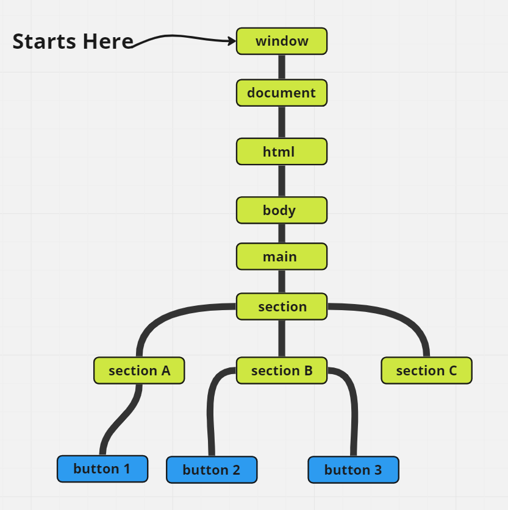
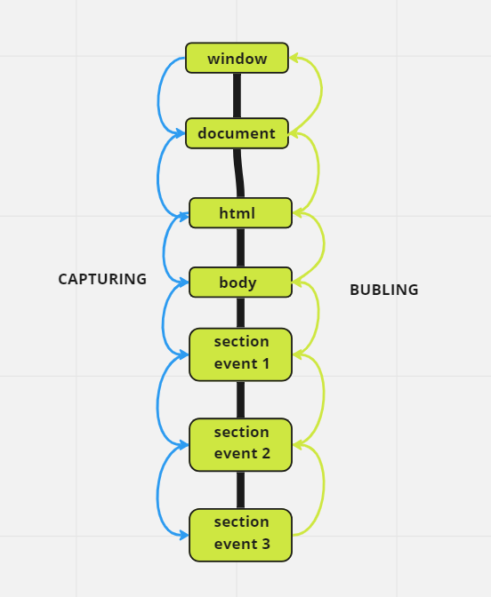

# Events

<small>Check <b>scripts/events_and_handledrs.js</b> file for more details and examples.</small>
<small>Check <b>scripts/capturing_and_bubling.js</b> file for more details and examples.</small>

> Events **don't start** at the element you trigger them on. Events **awlays start at the root**.

```html
<!DOCTYPE html>
<html>

<body>
  <main>

    <section>

      <section id="section_A" >
        <button id="first-button">one</button>
      </section>

      <section id="section_B">
        <button id="second-button">two</button>
        <button id="buttonThree">three</button>
      </section>

    </section>

    <section  id="section_C">
    </section>
  </main>

</body>

</html>
```
 


## Summary 

> There a 3 ways to assign event handlers: 
  1. HTML attribute: `onclick="..."`.
  2. DOM property: `elem.onclick = function`.
  3. Methods: `elem.addEventListener(event, handler[, phase])` to add, `removeEventListener` to remove.

> HTML attributes are used spraingly, because JavaScript in the middle of an HTML tag looks odd. You can't write a lot of code there.

> DOM properties are ok to use, but we can't assign more than one handler of the particular event.

> The last way is the most flexible, but it is also the longest to write. There are few events that only work with it, for instance `transitionend` and `DOMContentLoaded`. Also `addEventListener` supports objects as event handlers. In that case the method handleEvent is called in case of the event.

> No matter how you assign the handler – it gets an event object as the first argument. That object contains the details about what’s happened.

> **Almost** all events bubbles. For example the **focus** event does **NOT** bubbles.

> The most deeply nested element that cause the event is called a **target element**, accessible as `event.target`.

> `this` is the "current" element, the one that has a currently running handler on it.

> _Note_ the difference from `this` (=`event.currentTarget`):
-`event.target` - is the "target" element that initiated the event, it doesn't change trough the bubbling process.
-`this` is the "current" element, the one that has a currently running handler on it.
For instance, if we have a single handler `form.onClick`, then it can "catch" all clicks inside the form. No matter where the click happened, it bubbles up to <form> and runs the handler.
In `form.onclick` handler:
-`this`(=`event.currentTarget`) is the `<form>` element, because the handler runs on it.
-`event.target` is the actual element isnide the form that was clicked

```html
<!-- HTML -->
<!DOCTYPE HTML>
<html>

<head>
  <meta charset="utf-8">
  <link rel="stylesheet" href="example.css">
</head>

<body>
  A click shows both <code>event.target</code> and <code>this</code> to compare:

  <form id="form">FORM
    <div>DIV
      <p>P</p>
    </div>
  </form>

  <script src="script.js"></script>
</body>
</html>
```

```css
/* CSS */
form {
  background-color: green;
  position: relative;
  width: 150px;
  height: 150px;
  text-align: center;
  cursor: pointer;
}

div {
  background-color: blue;
  position: absolute;
  top: 25px;
  left: 25px;
  width: 100px;
  height: 100px;
}

p {
  background-color: red;
  position: absolute;
  top: 25px;
  left: 25px;
  width: 50px;
  height: 50px;
  line-height: 50px;
  margin: 0;
}

body {
  line-height: 25px;
  font-size: 16px;
}
```

```js
// JavaScript
form.onclick = function(event) {
  event.target.style.backgroundColor = 'yellow';

  // chrome needs some time to paint yellow
  setTimeout(() => {
    alert("target = " + event.target.tagName + ", this=" + this.tagName);
    event.target.style.backgroundColor = ''
  }, 0);
};
```
> It's possible that `event.target` could equal `this` - it happens when  click is made directly on the `<form>` element.

> A bubbling event goes from the target element straight up. Normaly goes upward till `<html>`, and then to `document` object, and some events even reach `window`, **calling all handlers on the path**. But any handler may decide the event has been fully processed and stop the bubbling.
-`event.stopPropagation()` - method will do that.
*Note*: the `event.stopPropagation()` method stops the move upwards, if there is more event handlers attached to the element they will be executed.
-`event.stopImmediatePropagation()` - method stops the bubbling and **prevent** handlers on the current element from running.

> **Don't stop the bubbling without a need!**
---

<small>
  References and resources
  <ul>
    <li>
      <a src="https://javascript.info/introduction-browser-events" style="color: naviblue; cursor: pointer"> Introduction to browser events</a>
    </li>
    <li>
      <a src="https://www.kirupa.com/html5/event_capturing_bubbling_javascript.htm" style="color: naviblue; cursor: pointer">Event capturing bubbling javascript</a>
    </li>
    <li>
      <a src="https://javascript.info/bubbling-and-capturing" style="color: naviblue; cursor: pointer">Bubling and capturing</a>
    </li>
  </ul>
</small>