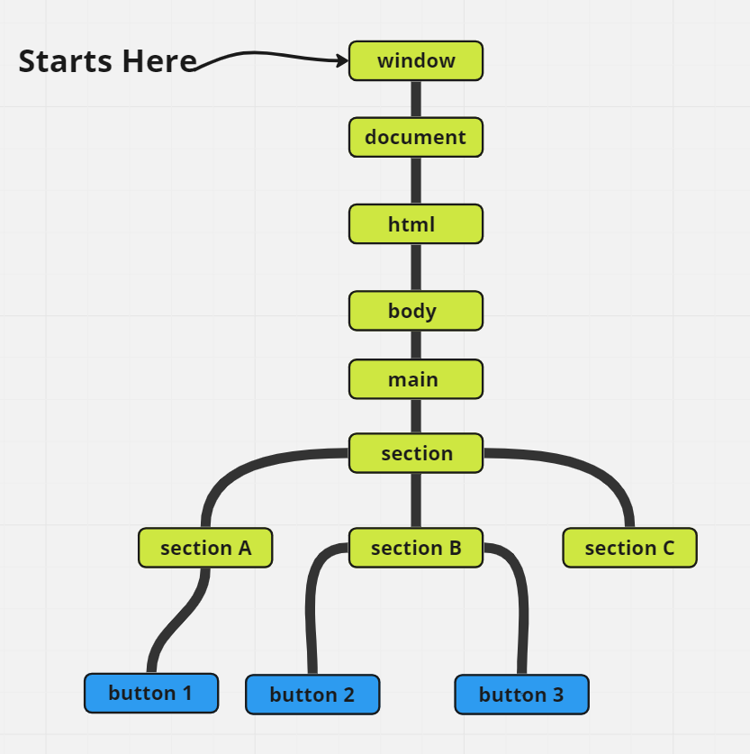

# Events

<small>Check <b>events_and_handledrs.js</b> file for more details and examples.</small>

> Events **don't start** at the element you trigger them on. Events **awlays start at the root**.

```html
<!DOCTYPE html>
<html>

<body>
  <main>

    <section>

      <section id="section_A" >
        <button id="first-button">one</button>
      </section>

      <section id="section_B">
        <button id="second-button">two</button>
        <button id="buttonThree">three</button>
      </section>

    </section>

    <section  id="section_C">
    </section>
  </main>

</body>

</html>
```


## Summary 

> There a 3 ways to assign event handlers: 
  1. HTML attribute: `onclick="..."`.
  2. DOM property: `elem.onclick = function`.
  3. Methods: `elem.addEventListener(event, handler[, phase])` to add, `removeEventListener` to remove.

> HTML attributes are used spraingly, because JavaScript in the middle of an HTML tag looks odd. You can't write a lot of code there.

> DOM properties are ok to use, but we can't assign more than one handler of the particular event.

> The last way is the most flexible, but it is also the longest to write. There are few events that only work with it, for instance `transitionend` and `DOMContentLoaded`. Also `addEventListener` supports objects as event handlers. In that case the method handleEvent is called in case of the event.

> No matter how you assign the handler – it gets an event object as the first argument. That object contains the details about what’s happened.


<small>
  References and resources
  <ul>
    <li>
      <a src="https://javascript.info/introduction-browser-events" style="color: yellow; cursor: pointer"> Introduction to browser events</a>
    </li>
        <li>
      <a src="https://www.kirupa.com/html5/event_capturing_bubbling_javascript.htm" style="color: yellow; cursor: pointer">Event capturing bubbling javascript</a>
    </li>
  </ul>
</small>